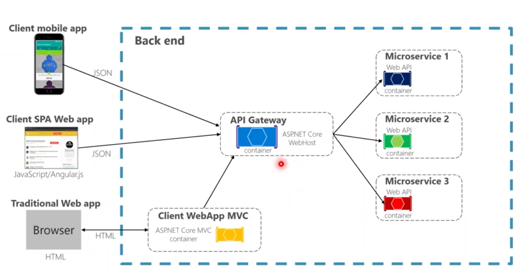
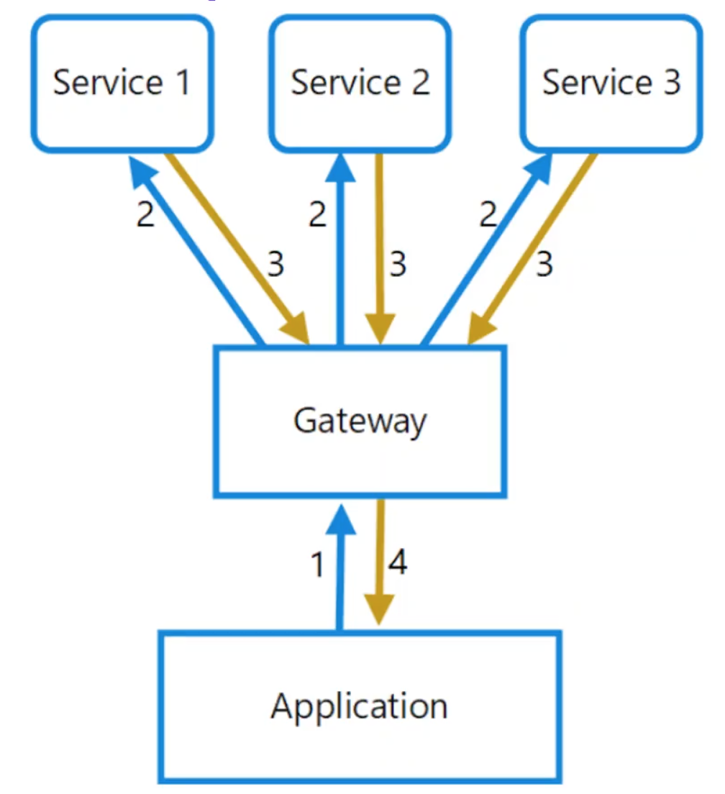

# AspnetMicroservices

It is written using .net core 7.0

### Mongo

- `docker pull mongo` to pull the mongo image
- `docker run -d -p 27017:27017 --name shopping-mongo mongo` to run the mongo image
- `docker logs -f shopping-mongo` to see the logs of the mongo image
- `docker exec -it shopping-mongo bin/bash` to enter the mongo image

### Mongosh

- `mongosh` to enter the mongo shell
- `show dbs` to show the databases
- `use CatalogDb` to use the CatalogDb database and creating if not available
- `show databases` to show the databases
- `show collections` to show the collections
- `db.createCollection('Products')` to create the Products collection
- `db.insertOne({name: 'Test', description: 'Test'})` to insert a document into the Products collection
- `db.Products.find({})` to find all documents in the Products collection
- `db.Products.find({}).pretty()` to find all documents in the Products collection in a pretty format
- `db.Products.find({name: 'Test'}).pretty()` to find all documents in the Products collection with name equal to Test in a pretty format
- `db.Products.find({name: 'Test', description: 'Test'}).pretty()` to find all documents in the Products collection with name equal to Test and description equal to Test in a pretty format
- `db.Products.find({name: 'Test', description: 'Test'}).count()` to find the count of all documents in the Products collection with name equal to Test and description equal to Test
- `db.Products.insetMany([{name: 'Test1', description: 'Test1'}, {name: 'Test2', description: 'Test2'}])` to insert many documents into the Products collection
- `db.Products.remove({})` to remove all documents in the Products collection
- `db.Products.drop()` to drop the Products collection
- `db.dropDatabase()` to drop the CatalogDb database

### Redis

- `docker pull redis` to pull the redis image
- `docker run -d -p 6379:6379 --name aspnetrun-redis redis` to run the redis image
- `docker logs -f aspnetrun-redis` to see the logs of the redis image
- `docker exec -it aspnetrun-redis redis-cli` to enter the redis image
- `docker exec -it aspnetrun-redis bin/bash` to enter the redis image

## Catalog REST APIs

| Method | Request URI                                    | Use Case                        |
| ------ | ---------------------------------------------- | ------------------------------- |
| GET    | api/v1/Catalog                                 | Listing Products and Categories |
| GET    | api/v1/Catalog/{id}                            | Get Product with ProductId      |
| GET    | api/v1/Catalog/GetProductByCategory/{category} | Get Products with Category      |
| POST   | api/v1/Catalog                                 | Create new Product              |
| PUT    | api/v1/Catalog                                 | Update Product                  |
| DELETE | api/v1/Catalog/{id}                            | Delete Product                  |

## Basket REST APIs

| Method | Request URI            | Use Case                                            |
| ------ | ---------------------- | --------------------------------------------------- |
| GET    | api/v1/Basket          | Get Basket and Items with username                  |
| POST   | api/v1/Basket          | Update Basket and Items (Add remove item to basket) |
| DELETE | api/v1/Basket/{id}     | Delete Basket                                       |
| POST   | api/v1/Basket/Checkout | Checkout Basket                                     |

## Order REST APIs

| Method | Request URI  | Use Case                                            |
| ------ | ------------ | --------------------------------------------------- |
| GET    | api/v1/Order | Get Orders with username                            |
| POST   | api/v1/Order | Update Basket and Items (Add remove item to basket) |

## Catalog/Basket Architecture

Tradition n-tier architecture:

User -> Presentation Layer (UI Component => Presentation Layer) -> Business Logic Layer (Service Layer => Business Logic Layer) -> Data Access Layer -> Database (Data Source)

- Data Access Layer: Only database operations are performed here, Add, Update, Delete, Get data from database.
- Business Logic Layer: Only business logic is implemented here, It will process data taken from the Data Access Layer and return it to the Presentation Layer. We dont use this layer directly, the data comes from user to the Presentation Layer and then to the Business Logic Layer, processed and send to data access layer and then to the database.
- Presentation Layer: This is the layer where the user interact. It can be a web application or API. The main purpose of this layer to show the data to the user and take the data from the user and send it to the Business Logic Layer.

## Simple Data-Driven CRUD Microservice Architecture

API/Application Layer -> Domain Model Layer -> Infrastructure Layer

- API/Application Layer: Entry point into the service. Exposes endpoints and enforces validations. It will be controller classes.

- Domain Model Layer: Contains business rules and logic. Business operations are implemented here

- Infrastructure Layer: Provides infrustructure plumbing. Primary responsibility is to presistance of business state.

## Repository Design Pattern

It follows solid patterns. I has two purpose it is an abstration of data layer and it is a way to centralize handling the domain object. It is like a middle layer between the application and data access logic. It makes code easy to maintain and test.

## Order Microservice Architecture

- Includes CRUD operations
- Implemented Domain-Driven Design (DDD), CQRS, Clean Architecture,
- Used best practices and SOLID principles
- Developed CQRS implementation on commands and queries with using MediatR, FluentValidation and AutoMapper packages
- Entity Framework Core Code-First approach

#### Get Order by Username

- Consume basketCheckout event from RabbitMQ
- CQRS implements with triggering OrderCommand to insert order record to database

## API Gateway

When design and build large complex microservice-based applications with multiple client applications, a good approch to consider is an API Gateway. This pattern is a service provides a single-entry point into the certain groups of microservices. It is similar to Facade pattern from object-oriented desing, in this case it is a part of a distributed system.

The API Gateway pattern is also known as the "backend for frontend" (BFF) because you build it while thinking about the needs of the client application. Therefore, it sits between the clients and the microservices. It acts as a reverse proxy, routing requests from clients to services. It can also provide other cross-cutting functionality such as authentication, SSL termination, and cache.

The API Gateway handles requests in one of two ways. Some requests are simply proxied/routed to the appropriate service. It handles other requests by fanning out to multiple services.
used to handle requests by routing them to the appropriate backend service or by invoking multiple backend services and aggregating the results.

In the bellow example, the API Gateway would be implemented as a custom ASP.NET Core WebHost services. Usually it is not a good idea to have a single API Gateway aggregating all the internal microservices. If it does, it acts a monolithic aggregator or orchestrator and violates microservice autonomy by coupling all the microservices. Therefore, the API Gateways should be segregated by business boundaries and the cient applications and should not act as a single aggregator for all the internal microservices.

It is better to have multiple API Gateways, each one for a specific group of microservices. This way, the API Gateway is closer to the client application and can be optimized for its needs.

### BFF Backend for Frontend Pattern

When splitting the API Gateway tier into multiple API Gateways, if the application has multiple client apps, there can be a primary pivot when identifying the multiple API Gateways types, so that you can have a different Facade for the needs of each client application. That means you can split to the requirements. As for the client into the custom API gateway with applying the BFF Backend for Frontend Pattern

### Ocelot API Gateway

It is a Lightweight API Gateway that recommended for simpler approches.
Ocelot is an Open Source API Gateway built using .NET Core. It is aimed at microservices architectures where there is a need for a unified entry point into the system.

It is lightweight, fast, scalable and provides routing, filtering, caching, authentication, rate limiting and load balancing out of the box. The main reason to choose Ocelot for our reference application is because it is a lightweight .NET Core API Gateway. It is easy to use and configure. It is also open source and has a very active community. It can be deploy into the same application deployment environment where we deploy our microservices or containers such as Docker Host, Kubernetes and etc.

Ocelot is designed to work .NET Core only.

## Analysis and Design of API Gateway

- Route Catalog APIs with /Catalog path
- Route Basket APIs with /Basket path
- Route Order APIs with /Order path

| Method   | Request URI      | Use Case                   |
| -------- | ---------------- | -------------------------- |
| GET/POST | /Catalog         | Route /api/v1/Catalog APIs |
| GET      | /Catalog/{id}    | Route /api/v1/Catalog APIs |
| GET/POST | /Basket          | Route /api/v1/Basket APIs  |
| POST     | /Basket/Checkout | Route /api/v1/Basket APIs  |
| GET      | /Order           | Order /api/v1/Order APIs   |

## Gateway Aggregation Pattern

Using a gateway to aggregate multiple individual requests are made a single request.This pattern is useful when a client must make multiple calls to different backend systems to perform an operation.

In order to perform a single task, a client may have to make multiple calls to various backend services. An application that relies on many services to perform a task must expend resources on each request. For example, When any new feature or service is added to the application, additional requests are needed, further increasing resource requirements and network calls. This chattiness between a client and a backend can adversely impact the performance and scale of the application.

Microservice architectures have made this problem more common, as applications built around many smaller services naturally have a higher amount of cross-service calls. So, as a solution of that, use a gateway to reduce chattiness between the client and the services. The gateway can aggregate multiple requests into a single request, reducing the number of round trips between the client and the backend services.

Using chain http calls are not a good practice. It is better to use a gateway to aggregate multiple individual requests are made a single request.
